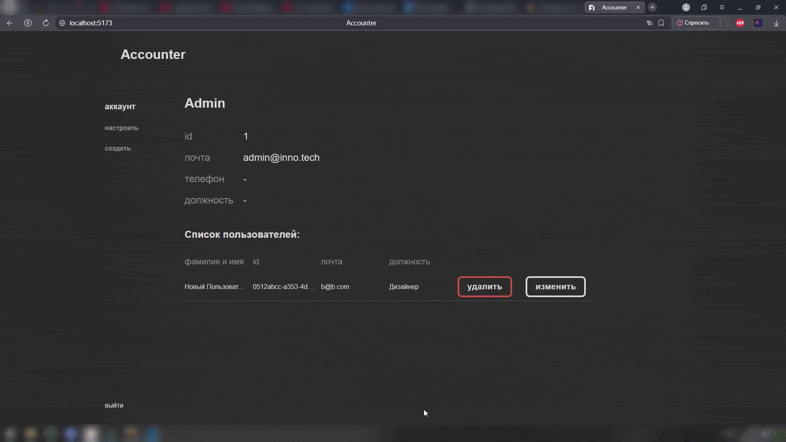

# Клиент – Работа с формами и аутентификацией

## Описание кейса:

Поработать с менеджерами форм и аутентификацией

## Реализованный функционал:

### Суть проекта:

- Существует admin (log: admin@inno.tech, pas: admin)
  [](https://raw.githubusercontent.com/ZaplatiteZaSitePJ/t1-accounter/master/auth.gif)
- Admin может создавать и удалять других пользователей
  
  
- Admin может редактировать других пользователей и себя
- Другие пользователи могут пройти авторизацию, изменить некоторые свои параметры, но не имеют доступа к другим пользователям
  
- Так же пользователь не может удалить свой аккаунт
- Адаптивный дизайн
 

#### Важные замечания (в связи с заданием):

- Нельзя редактировать пароль и email

### Функционал

Страницы:
      - Аккаунт (с описанием активного пользователя и с таблицей всех пользователей только для Admin)
      - Настроить (страница редактирования учетной записи)
      - Создать (страница создания пользователей только для admin)
      - Страница входа

## Стэк:

-   ### Основной
    -   HTML / CSS / SCSS
    -   React / TS
-   #### Дополнительный
    -   Local Storage
    -   Cookie
    -   Vite
    -   React Router
    -   React Hook Form
    -   Material UI

## Инструкция к запуску через GitHub

```bash
git clone https://github.com/ZaplatiteZaSitePJ/t1-accounter

## 1-ый git bash
cd t1-accounter/backend
npm install
npm run start

## 2-ой git bash
cd t1-accounter/accounter
npm install
npm run dev
```
